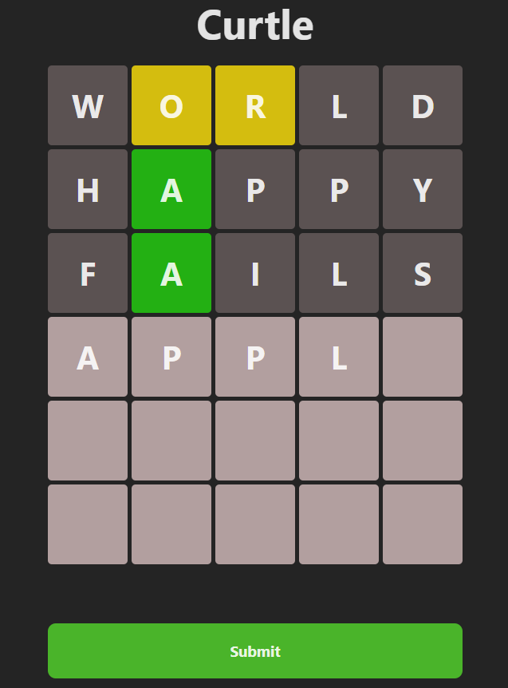

# Wordle Clone

A simple Wordle clone built with React and TypeScript.


## Features

- 5-letter word guessing game
- Built with React and TypeScript
- Basic keyboard input and color feedback

## Getting Started

### Prerequisites

- Node.js (v18 or higher recommended)
- npm

### Installation

Clone the repository:

```bash
git clone git@github.com:CCHaynes112/wordle.git
cd wordle
```

Install dependencies:
```bash
npm install
```

Run the development server:
```bash
npm run dev
```

The app should now be running at http://localhost:5173